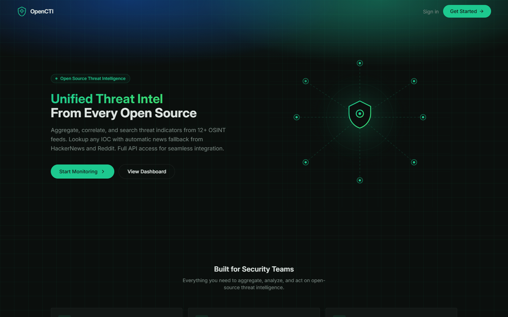
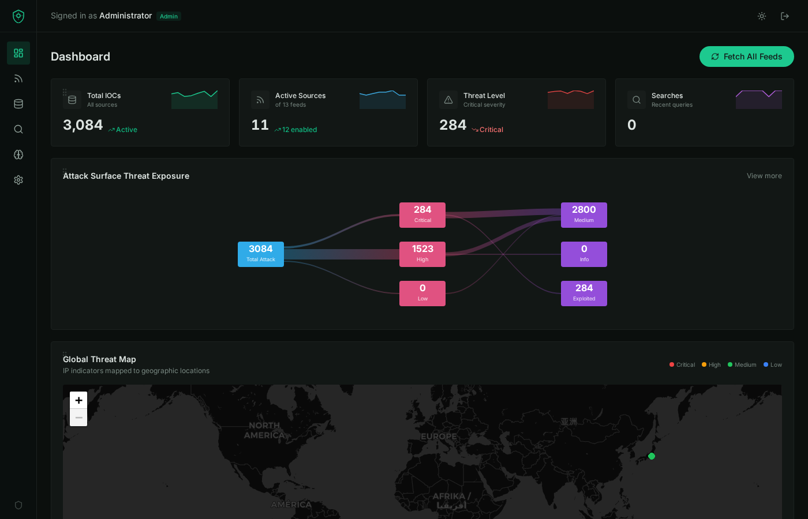
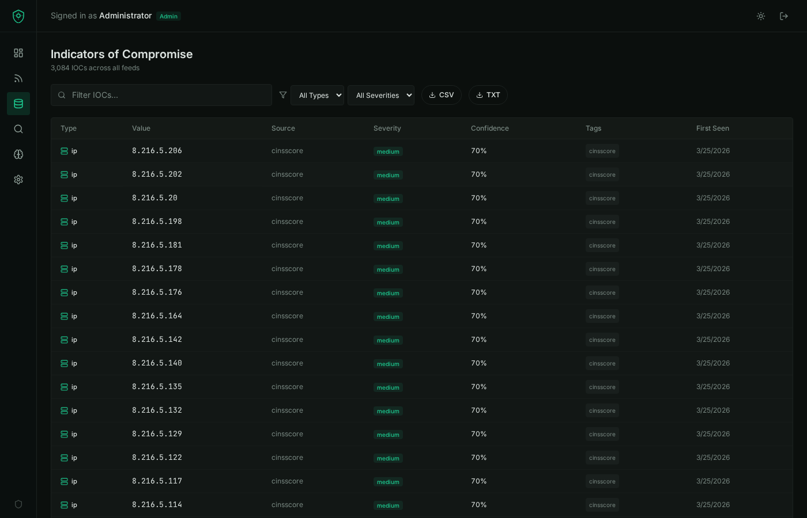
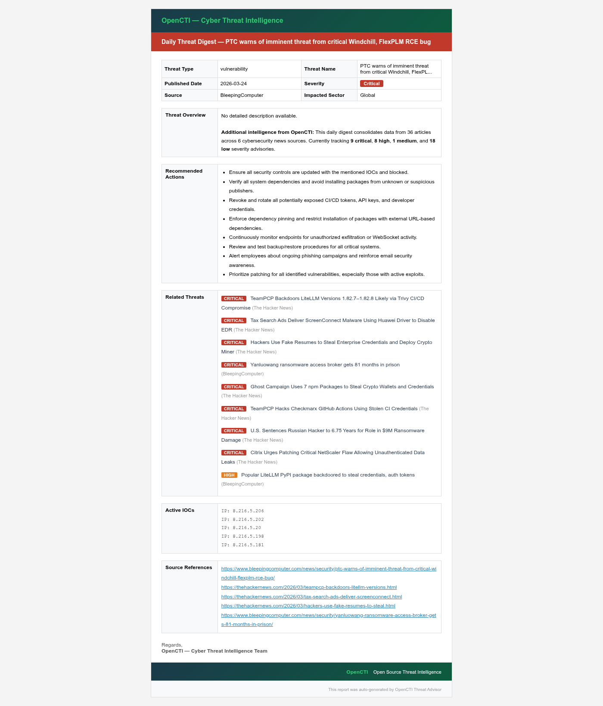

<p align="center">
  
</p>

<h1 align="center">OpenCTI — Open Source Threat Intelligence Platform</h1>

<p align="center">
  Aggregate, correlate, and search threat indicators from 13+ OSINT feeds.<br/>
  Lookup any IOC with automatic news fallback. Full REST API for seamless integration.
</p>

<p align="center">
  
  
  
  
  
</p>

---

## Table of Contents

- [Features](#features)
- [Screenshots](#screenshots)
- [Architecture](#architecture)
- [Tech Stack](#tech-stack)
- [OSINT Feed Sources](#osint-feed-sources)
- [Threat Advisor News Sources](#threat-advisor-news-sources)
- [Threat Advisory Report](#threat-advisory-report)
- [Getting Started](#getting-started)
  - [Prerequisites](#prerequisites)
  - [Local Development](#local-development)
  - [Docker Deployment](#docker-deployment)
  - [AWS EC2 Deployment](#aws-ec2-deployment)
- [Environment Variables](#environment-variables)
- [Platform Pages](#platform-pages)
- [REST API](#rest-api)
- [Role-Based Access Control](#role-based-access-control)
- [Project Structure](#project-structure)
- [Contributing](#contributing)
- [License](#license)

---

## Features

- **13 OSINT Threat Feeds** — Aggregates indicators from Abuse.ch (URLhaus, Feodo Tracker, SSL Blacklist, ThreatFox), Blocklist.de, C2 IntelFeeds, OpenPhish, DigitalSide, Emerging Threats, CINSscore, MalwareBazaar, Disposable Email Domains, and AlienVault OTX
- **Auto-Sync Feeds** — Feeds are automatically fetched every 15 minutes, with a manual sync button available for ad-hoc refreshes
- **IOC Lookup** — Search any IP, domain, URL, or hash across all feeds with automatic news fallback from HackerNews and Reddit
- **IOC Export** — Export filtered indicators as CSV (full details) or TXT (values only, for blocklist import)
- **Global Threat Map** — Interactive Leaflet map plotting IP indicators by geographic location with severity-coded markers, auto-refreshing every 2 minutes
- **Threat Advisor** — Real-time RSS aggregation from 12 cybersecurity news sources with severity classification, source filtering, and daily email advisory report generation
- **Daily Advisory Email** — SMTP-powered email reports containing only the last 24 hours of alerts, sorted from critical to low severity
- **Interactive Dashboard** — Draggable/rearrangeable KPI cards, Sankey attack surface chart, geo threat map, IOC distribution charts
- **REST API v1** — Full programmatic access with API key authentication (`octi_` prefixed keys)
- **Admin Settings Panel** — Manage API keys, configure SMTP email server, toggle auth providers, set data retention, manage feeds and OTX API key
- **Role-Based Access** — Separate admin and user roles with admin-only features (settings, feed management, data purge)
- **Data Retention & Purge** — Configurable 3-month / 6-month / 1-year retention with manual and auto purge
- **Docker Containerized** — Multi-stage Docker build with PostgreSQL, ready for production deployment
- **Light & Dark Mode** — Full theme support including map tile switching

---

## Screenshots

### Dashboard
<p align="center">
  
</p>

### IOC Management with Export
<p align="center">
  
</p>

### Threat Advisory Report
<p align="center">
  
</p>

The advisory report is a professional email-ready document that includes:
- **Threat metadata** — Type, name, published date, severity, source, impacted sector
- **Threat overview** — Consolidated intelligence from all tracked sources
- **Recommended actions** — Context-aware response guidance
- **Related threats** — Sorted by severity (critical first), with source attribution
- **Active IOCs** — Current indicators from the platform database
- **Source references** — Direct links to original articles

Reports only include alerts from the **last 24 hours** and are sorted **critical → high → medium → low**.

---

## Architecture

```
┌────────────────────────────────────────────────────────┐
│                      Client (React)                     │
│  Landing · Auth · Dashboard · Feeds · IOCs · Lookup     │
│  Threat Advisor · Settings (API + SMTP + Admin)         │
└───────────────────────┬────────────────────────────────┘
                        │ HTTP / REST
┌───────────────────────▼────────────────────────────────┐
│                   Server (Express.js)                   │
│  Routes · Feed Parsers · RSS Aggregator · Auth          │
│  OTX Integration · Auto-Sync (15min) · SMTP Email       │
│  IP Geolocation · Data Retention · Report Generator     │
└───────────────────────┬────────────────────────────────┘
                        │
┌───────────────────────▼────────────────────────────────┐
│              Storage (In-Memory / PostgreSQL)            │
│  Users · Feeds · Indicators · Settings · Subscribers    │
└────────────────────────────────────────────────────────┘
          │               │               │
   OSINT Feeds       RSS Sources     AlienVault OTX
  (13 sources)      (12 sources)      (Pulse API)
          │                               │
     ip-api.com                      nodemailer
   (Geolocation)                   (SMTP Email)
```

---

## Tech Stack

| Layer | Technology |
|-------|-----------|
| **Frontend** | React 18, TypeScript, Tailwind CSS, shadcn/ui, Recharts, Leaflet, @dnd-kit, Wouter |
| **Backend** | Node.js 20, Express.js, TypeScript, Nodemailer |
| **Database** | In-memory (dev) / PostgreSQL 16 (production) |
| **ORM** | Drizzle ORM with Zod validation |
| **Build** | Vite 5 (frontend), esbuild (backend) |
| **Container** | Docker (multi-stage), Docker Compose |
| **Maps** | Leaflet + CartoDB tiles (dark/light) |
| **Fonts** | Inter (UI), JetBrains Mono (code) |

---

## OSINT Feed Sources

| # | Feed | Category | Description |
|---|------|----------|-------------|
| 1 | Abuse.ch URLhaus | URL | Malicious URLs used for malware distribution |
| 2 | Abuse.ch Feodo Tracker | IP | Botnet C2 IP blocklist (Dridex, Emotet, TrickBot, QakBot) |
| 3 | Abuse.ch SSL Blacklist | IP | SSL certificates associated with C2 servers |
| 4 | Abuse.ch ThreatFox | Mixed | IOCs from malware including C2 infrastructure |
| 5 | Blocklist.de All Attacks | IP | IPs reported as attack sources in last 48 hours |
| 6 | C2 IntelFeeds | IP | Command and Control server IP addresses |
| 7 | OpenPhish | URL | Verified phishing URLs |
| 8 | DigitalSide Threat-Intel | URL | OSINT-based malware distribution URLs |
| 9 | Emerging Threats | IP | Known compromised IPs from ProofPoint |
| 10 | CINSscore Bad IPs | IP | Most active bad IPs from Sentinel IPS |
| 11 | MalwareBazaar | Hash | Recent malware samples with SHA256 hashes |
| 12 | Disposable Email Domains | Domain | Known disposable/temporary email domains |
| 13 | AlienVault OTX | Mixed | Community-driven threat data via OTX Pulse API |

All feeds are **auto-synced every 15 minutes**. Manual sync is also available via the dashboard button.

---

## Threat Advisor News Sources

| # | Source | URL |
|---|--------|-----|
| 1 | The Hacker News | https://thehackernews.com |
| 2 | Qualys Blog | https://blog.qualys.com |
| 3 | Rapid7 Blog | https://www.rapid7.com/blog/ |
| 4 | CISA Alerts | https://www.cisa.gov |
| 5 | Securelist (Kaspersky) | https://securelist.com |
| 6 | ENISA News | https://www.enisa.europa.eu |
| 7 | CyberSecurity News | https://cybersecuritynews.com |
| 8 | SecurityOnline | https://securityonline.info |
| 9 | Techzine EU | https://www.techzine.eu |
| 10 | AlienVault OTX Pulse | https://otx.alienvault.com |
| 11 | BleepingComputer | https://www.bleepingcomputer.com |
| 12 | Krebs on Security | https://krebsonsecurity.com |

---

## Threat Advisory Report

OpenCTI generates professional threat advisory emails that can be sent to subscribers via SMTP.

<p align="center">
  
</p>

### Report Features
- **Daily digest** — Only includes articles from the last 24 hours
- **Severity-sorted** — Critical threats appear first, followed by high, medium, and low
- **Consolidated intelligence** — Data from all 12 news sources in a single report
- **Active IOCs** — Includes current indicators from the platform database
- **Source references** — Direct links to original articles for further investigation
- **Recommended actions** — Context-aware response guidance based on threat tags

### SMTP Configuration
Configure your email server in **Settings → Email Server (SMTP)**:
- Supports any SMTP server (Gmail, Outlook, SendGrid, custom)
- TLS/SSL toggle for secure connections
- Built-in connection test button
- Gmail users: Use App Passwords with `smtp.gmail.com:587`

---

## Getting Started

### Prerequisites

- **Node.js** 20+ and **npm** (for local development)
- **Docker** and **Docker Compose** (for containerized deployment)

### Local Development

```bash
# Clone the repository
git clone https://github.com/saichand04/openCTI.git
cd openCTI

# Install dependencies
npm install

# Start the development server (hot reload)
npm run dev

# Access at http://localhost:5000
```

Feeds auto-sync 30 seconds after startup and every 15 minutes thereafter.

### Docker Deployment

```bash
# Clone the repository
git clone https://github.com/saichand04/openCTI.git
cd openCTI

# (Optional) Create a .env file from the example
cp .env.example .env
# Edit .env to set your OTX_API_KEY, ADMIN_PASSWORD, and SMTP settings

# Build and start containers
docker-compose up -d

# Access at http://localhost:5000
```

**Docker services started:**
- `opencti-app` — Node.js application on port 5000
- `opencti-db` — PostgreSQL 16 database with persistent volume

**Useful Docker commands:**

```bash
# View logs
docker-compose logs -f opencti-app

# Stop the platform
docker-compose down

# Stop and wipe all data (including database)
docker-compose down -v

# Rebuild after code changes
docker-compose up -d --build
```

### AWS EC2 Deployment

1. Launch an EC2 instance (Ubuntu 22.04, t3.small or larger recommended)
2. Install Docker and Docker Compose:
   ```bash
   sudo apt update && sudo apt install -y docker.io docker-compose
   sudo usermod -aG docker $USER
   newgrp docker
   ```
3. Clone the repository and start:
   ```bash
   git clone https://github.com/saichand04/openCTI.git
   cd openCTI
   cp .env.example .env
   # Edit .env with your secrets
   docker-compose up -d
   ```
4. Configure security group to allow inbound TCP on port 5000
5. Access via `http://<ec2-public-ip>:5000`

---

## Environment Variables

| Variable | Description | Default |
|----------|-------------|---------|
| `NODE_ENV` | Node environment (`development` or `production`) | `development` |
| `DATABASE_URL` | PostgreSQL connection string | In-memory if not set |
| `OTX_API_KEY` | AlienVault OTX API key ([get one here](https://otx.alienvault.com)) | Empty |
| `ADMIN_PASSWORD` | Password for the admin account | `admin123` |
| `SMTP_HOST` | SMTP server hostname | Empty |
| `SMTP_PORT` | SMTP server port | `587` |
| `SMTP_SECURE` | Use SSL/TLS (`true`/`false`) | `false` |
| `SMTP_USER` | SMTP username/email | Empty |
| `SMTP_PASS` | SMTP password/app password | Empty |
| `SMTP_FROM` | Sender email address | Same as SMTP_USER |
| `SMTP_FROM_NAME` | Sender display name | `OpenCTI Threat Advisory` |

Create a `.env` file from `.env.example` to configure these variables.

---

## Platform Pages

| Page | Route | Description |
|------|-------|-------------|
| **Landing** | `/` | Public homepage with platform overview and feature highlights |
| **Auth** | `/#/auth` | User login (email/OAuth) and Admin login (username/password) tabs |
| **Dashboard** | `/#/dashboard` | Draggable KPI cards, Sankey chart, global threat map, IOC charts |
| **Feeds** | `/#/feeds` | List of all 13 threat feeds with status, IOC counts, and fetch controls |
| **IOCs** | `/#/indicators` | Searchable, filterable table with CSV/TXT export |
| **Lookup** | `/#/lookup` | IOC search with cross-feed lookup and news fallback |
| **Threat Advisor** | `/#/threat-advisor` | News aggregation with severity classification and advisory reports |
| **Settings** | `/#/settings` | Admin-only: API keys, SMTP email, auth providers, data retention, feeds |

---

## REST API

All API endpoints are prefixed with `/api/`. Authenticated endpoints require an API key header:

```
X-API-Key: octi_your_api_key_here
```

### Key Endpoints

| Method | Endpoint | Description |
|--------|----------|-------------|
| `GET` | `/api/feeds` | List all configured threat feeds |
| `POST` | `/api/feeds/fetch-all` | Trigger manual fetch for all enabled feeds |
| `POST` | `/api/feeds/:slug/fetch` | Fetch a specific feed |
| `GET` | `/api/indicators` | List indicators (supports `?search=`, `?source=`, `?severity=`, `?type=`) |
| `GET` | `/api/lookup/:ioc` | Lookup a specific IOC across all feeds |
| `GET` | `/api/stats` | Platform statistics |
| `GET` | `/api/dashboard/geo` | IP indicator geolocation data for the threat map |
| `GET` | `/api/threat-advisor/articles` | Get aggregated threat news articles |
| `GET` | `/api/threat-advisor/report` | Generate HTML advisory report (last 24h, sorted by severity) |
| `POST` | `/api/threat-advisor/send-report` | Send advisory report via SMTP to all subscribers |
| `POST` | `/api/threat-advisor/subscribe` | Subscribe an email to advisory alerts |
| `POST` | `/api/auth/admin-login` | Admin login (username/password) |
| `GET` | `/api/settings` | Get platform settings (admin only) |
| `PATCH` | `/api/settings` | Update platform settings (admin only) |
| `POST` | `/api/settings/smtp-test` | Test SMTP connection (admin only) |
| `POST` | `/api/settings/purge` | Purge old indicator data (admin only) |

---

## Role-Based Access Control

| Feature | Regular User | Administrator |
|---------|:------------:|:-------------:|
| View Dashboard | ✅ | ✅ |
| View Feeds | ✅ | ✅ |
| Search IOCs | ✅ | ✅ |
| Export IOCs (CSV/TXT) | ✅ | ✅ |
| IOC Lookup | ✅ | ✅ |
| Threat Advisor | ✅ | ✅ |
| Fetch All Feeds | ❌ | ✅ |
| Add/Delete Feeds | ❌ | ✅ |
| Settings Page | ❌ | ✅ |
| SMTP Configuration | ❌ | ✅ |
| Send Advisory Email | ❌ | ✅ |
| Data Purge | ❌ | ✅ |
| Manage Auth Providers | ❌ | ✅ |

---

## Project Structure

```
openCTI/
├── client/                   # Frontend (React + Vite)
│   ├── src/
│   │   ├── components/ui/    # shadcn/ui components
│   │   ├── pages/            # Route pages
│   │   │   ├── landing.tsx   # Public landing page
│   │   │   ├── auth.tsx      # User & Admin login
│   │   │   ├── dashboard.tsx # Draggable dashboard with map
│   │   │   ├── feeds.tsx     # Feed management
│   │   │   ├── indicators.tsx# IOC table with export
│   │   │   ├── lookup.tsx    # IOC lookup
│   │   │   ├── threat-advisor.tsx  # News aggregator + reports
│   │   │   └── settings.tsx  # Admin settings (API + SMTP + config)
│   │   ├── hooks/            # Custom React hooks
│   │   ├── lib/              # Utilities and query client
│   │   ├── App.tsx           # Router and layout
│   │   ├── main.tsx          # Entry point
│   │   └── index.css         # Global styles + Tailwind
│   └── index.html            # HTML template
├── server/                   # Backend (Express)
│   ├── routes.ts             # API routes, feed parsers, SMTP, geo, auto-sync
│   ├── storage.ts            # In-memory storage with seed data
│   ├── index.ts              # Server entry point
│   ├── vite.ts               # Vite dev server middleware
│   └── static.ts             # Static file serving
├── shared/                   # Shared types
│   └── schema.ts             # Drizzle schema + Zod types
├── docs/
│   └── screenshots/          # Screenshots for documentation
├── Dockerfile                # Multi-stage Docker build
├── docker-compose.yml        # App + PostgreSQL services
├── .env.example              # Environment variable template
├── .dockerignore             # Docker build exclusions
├── .gitignore                # Git exclusions
├── package.json              # Dependencies and scripts
├── tsconfig.json             # TypeScript configuration
├── vite.config.ts            # Vite configuration
├── tailwind.config.ts        # Tailwind CSS configuration
└── README.md                 # This file
```

---

## Contributing

1. Fork the repository
2. Create a feature branch (`git checkout -b feature/my-feature`)
3. Commit your changes (`git commit -m 'Add my feature'`)
4. Push to the branch (`git push origin feature/my-feature`)
5. Open a Pull Request

---

## License

This project is licensed under the MIT License. See the [LICENSE](LICENSE) file for details.

---

<p align="center">
  Built with ❤️ for the cybersecurity community
</p>
